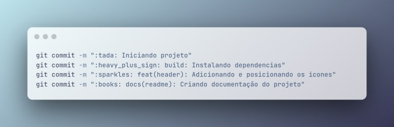

Tipos de Commits
O commit possui os elementos estruturais abaixo (tipos), que informam a intenção do seu commit ao utilizador(a) de seu código.

fix - Commits do tipo fix indicam que seu trecho de código commitado está solucionando um problema (bug fix), (se relaciona com o PATCH do versionamento semântico).

feat- Commits do tipo feat indicam que seu trecho de código está incluindo um novo recurso (se relaciona com o MINOR do versionamento semântico).

docs - Commits do tipo docs indicam que houveram mudanças na documentação, como por exemplo no Readme do seu repositório. (Não inclui alterações em código).

style - Commits do tipo style indicam que houveram alterações referentes a formatações de código, semicolons, trailing spaces, lint... (Não inclui alterações em código).

refactor - Commits do tipo refactor referem-se a mudanças devido a refatorações que não alterem sua funcionalidade, como por exemplo, uma alteração no formato como é processada determinada parte da tela, mas que manteve a mesma funcionalidade, ou melhorias de performance devido a um code review.

build - Commits do tipo build são utilizados quando são realizadas modificações em arquivos de build e dependências.

test - Commits do tipo test são utilizados quando são realizadas alterações em testes, seja criando, alterando ou excluindo testes unitários. (Não inclui alterações em código)

chore - Commits do tipo chore indicam atualizações de tarefas de build, configurações de administrador, pacotes... como por exemplo adicionar um pacote no gitignore. (Não inclui alterações em código)

| Tipo de commit                | Emojis                |
|-------------------------------|-----------------------|
| Commit inicial                | 🎉 :tada:             |
| Tag de versão                 | 🔖 :bookmark:         |
| Novo recurso                  | ✨ :sparkles:          |
| Lista de ideias (tasks)       | 🔜 :soon:             |
| Bugfix                        | 🐛 :bug:              |
| Documentação                  | 📚 :books:            |
| Testes                        | 🧪 :test_tube:         |
| Adicionando um teste          | ✅ :white_check_mark: |
| Teste de aprovação            | ✔️ :heavy_check_mark: |
| Acessibilidade                | ♿ :wheelchair:        |
| Texto                         | 📝 :pencil:            |
| Package.json em JS            | 📦 :package:           |
| Em progresso                  | 🚧 :construction:      |
| Arquivos de configuração      | 🔧 :wrench:            |
| Removendo uma dependência      | ➖ :heavy_minus_sign:  |
| Adicionando uma dependência    | ➕ :heavy_plus_sign:   |
| Revertendo mudanças           | 💥 :boom:             |
| Alterações de revisão de código | 👌 :ok_hand:           |
| Refatoração                   | ♻️ :recycle:           |
| Mover/Renomear                | 🚚 :truck:             |

